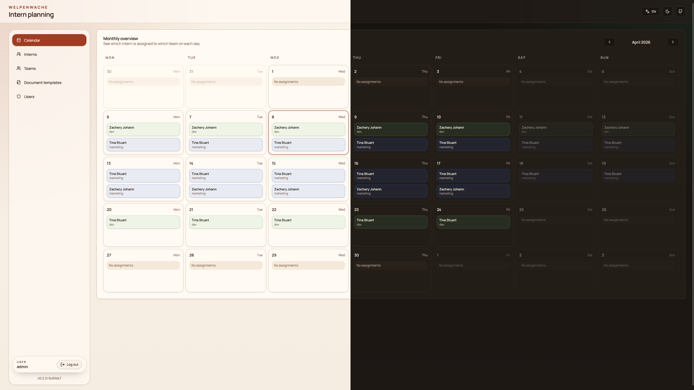

# WelpenWache

WelpenWache is an internal web application for managing interns, teams, supervisors, role-based access, document templates, and completion document downloads.

## App Screenshot



## Features

- Create and manage interns, including gender
- Create teams with colors and supervisors
- Track time-based team assignments within internships
- Use a monthly calendar view as the landing page
- Create the first administrator during initial setup
- Manage additional user accounts and permissions
- Upload and manage DOCX document templates for completion documents
- Generate completion documents directly from the intern detail page
- Serve the bundled frontend directly from the backend in production

## Project Structure

- `backend/WelpenWache.Api` - .NET 10 minimal API, EF Core, SQL Server, JWT authentication, document template storage, completion document generation
- `frontend` - React 19, Vite 8, TypeScript, TanStack Query, shadcn/ui
- `docker-compose.yml` - local SQL Server for development
- `Dockerfile` - production image with bundled frontend and backend
- `.github/workflows/release.yml` - builds the IIS release zip and publishes the Docker image to GHCR

## Developer Quick Start

This is the recommended local development setup:

- Run SQL Server in Docker
- Run the backend locally with `dotnet run`
- Run the frontend locally with `npm run dev`
- Store document templates in a writable local folder

### Prerequisites

- .NET SDK 10
- Node.js 24+
- Docker Desktop
- A writable absolute path for document templates

### 1. Start the local SQL Server

Copy the environment template and set a strong SQL password:

```powershell
Copy-Item .env.example .env
```

Then edit `.env` and replace `WELPENWACHE_SQL_PASSWORD` with your own password.

Start SQL Server:

```powershell
docker compose up -d
```

The compose file exposes SQL Server on `localhost:14333`.

### 2. Prepare a local document template folder

The completion workflow stores uploaded DOCX templates on disk. Create a local writable folder and use its absolute path for the backend:

```powershell
New-Item -ItemType Directory -Force .\.data\document-templates | Out-Null
```

### 3. Run the backend

Create or update `backend/WelpenWache.Api/appsettings.Development.json` and set the local SQL Server connection plus the local document template folder there:

```json
{
  "ConnectionStrings": {
    "DefaultConnection": "Server=localhost,14333;Database=WelpenWacheDb;User Id=sa;Password=<YOUR_SQL_PASSWORD>;TrustServerCertificate=True;"
  },
  "DocumentStorage": {
    "BasePath": "D:\\Projekte\\welpenwache\\.data\\document-templates"
  }
}
```

Then start the backend:

```powershell
dotnet run --project .\backend\WelpenWache.Api\WelpenWache.Api.csproj
```

Backend defaults:

- API URL: `http://localhost:5150`
- Database migrations are applied automatically on startup
- A random JWT signing key is generated automatically in development
- If `DocumentStorage__BasePath` is not overridden, the default path is `C:\ProgramData\WelpenWache\DocumentTemplates`

### 4. Run the frontend

Open a second PowerShell window:

```powershell
Set-Location .\frontend
npm install
$env:VITE_API_URL="http://localhost:5150"
npm run dev
```

Frontend default:

- App URL: `http://localhost:5173`

### 5. Complete the first-time setup

1. Open `http://localhost:5173`
2. Create the initial administrator account
3. Create teams, supervisors, and interns
4. Upload document templates in the `Document Templates` admin area
5. Trigger completion document generation from the intern detail page

### Alternative local database option

If LocalDB is installed on your machine, you can skip Docker and use the default connection string from `backend/WelpenWache.Api/appsettings.json`. The Docker SQL Server setup is the recommended path because it is easier to reproduce across machines.

## Document Templates

Completion document templates are stored on disk, while the database only keeps metadata and the relative file path.

Supported values:

- Template purpose: `completion`
- Template languages: `de`, `en`
- Gender keys: `male`, `female`, `diverse`

Relevant permissions:

- `documents.view` - view document templates and run completion document generation
- `documents.manage` - create, update, activate, deactivate, and delete document templates

### Example Configuration

`DocumentStorage` is required so the app knows where uploaded DOCX templates live. `CompletionDocuments` is optional. If you do not configure it, the built-in default values from the shipped `appsettings.json` are used.

```json
{
  "DocumentStorage": {
    "BasePath": "C:\\ProgramData\\WelpenWache\\DocumentTemplates"
  }
}
```

Only add `CompletionDocuments` if you want to override the default gender or salutation texts:

```json
{
  "DocumentStorage": {
    "BasePath": "C:\\ProgramData\\WelpenWache\\DocumentTemplates"
  },
  "CompletionDocuments": {
    "Genders": {
      "male": {
        "de": "M\u00E4nnlich",
        "en": "Male"
      },
      "female": {
        "de": "Weiblich",
        "en": "Female"
      },
      "diverse": {
        "de": "Divers",
        "en": "Diverse"
      }
    },
    "Salutations": {
      "male": {
        "de": "Herr",
        "en": "Mr."
      },
      "female": {
        "de": "Frau",
        "en": "Ms."
      },
      "diverse": {
        "de": "",
        "en": "Mx."
      }
    }
  }
}
```

Default configured values:

- `Genders.male.de` = `M\u00E4nnlich`
- `Genders.male.en` = `Male`
- `Genders.female.de` = `Weiblich`
- `Genders.female.en` = `Female`
- `Genders.diverse.de` = `Divers`
- `Genders.diverse.en` = `Diverse`
- `Salutations.male.de` = `Herr`
- `Salutations.male.en` = `Mr.`
- `Salutations.female.de` = `Frau`
- `Salutations.female.en` = `Ms.`
- `Salutations.diverse.de` = `""`
- `Salutations.diverse.en` = `Mx.`

Important notes:

- `DocumentStorage:BasePath` must be an absolute path
- The application process must be able to read and write that folder
- Active templates with purpose `completion` are used by the completion workflow
- If one active template matches, the user downloads one DOCX file
- If multiple active templates match, the user downloads a ZIP archive

## Template Syntax

Document generation uses [DocxTemplater](https://github.com/Amberg/DocxTemplater), so the DOCX layout and formatting stay in the template file.

Supported scalar placeholders include:

- `{{first_name}}`
- `{{last_name}}`
- `{{full_name}}`
- `{{salutation}}`
- `{{gender}}`
- `{{school}}`
- `{{notes}}`
- `{{start_date}}`
- `{{end_date}}`
- `{{export_date}}`
- `{{team}}`
- `{{internship_count}}`

Root-level placeholders also work with the `ds` prefix, for example:

- `{{ds.first_name}}`
- `{{ds.full_name}}`
- `{{ds.salutation}}`

Supported loop collections:

- `team_assignments`
- `internships`
- `internships[].assignments`

Fields available inside `team_assignments` and `internships[].assignments`:

- `{{.team_name}}`
- `{{.supervisor_name}}`
- `{{.start_date}}`
- `{{.end_date}}`
- `{{.internship_start_date}}`
- `{{.internship_end_date}}`

Fields available inside `internships`:

- `{{.start_date}}`
- `{{.end_date}}`
- `{{.note}}`

Example loop:

```text
{{#team_assignments}}
- {{.team_name}} ({{.start_date}} - {{.end_date}})
{{/team_assignments}}
```

## Build and Validation

Backend:

```powershell
dotnet build .\backend\WelpenWache.Api\WelpenWache.Api.csproj
```

Frontend lint:

```powershell
Set-Location .\frontend
npm run lint
```

Frontend production build:

```powershell
Set-Location .\frontend
npm run build
```

## Release Outputs

Every release pipeline currently publishes both deployment variants:

- GitHub release asset: `welpenwache-iis-<version>.zip`
- GitHub Container Registry image: `ghcr.io/sirkyomi/welpenwache:<version>`
- Floating container tag: `ghcr.io/sirkyomi/welpenwache:latest`

## Deployment for Users

Users can run WelpenWache in two supported ways: IIS or Docker.

### Option 1: Run the release package on IIS

1. Download the latest `welpenwache-iis-<version>.zip` from the GitHub Releases page.
2. Install the .NET 10 ASP.NET Core Hosting Bundle on the Windows server.
3. Prepare a SQL Server database that the application can reach.
4. Extract the zip file to the final site folder.
5. Create an IIS site or IIS application that points to that folder.
6. Use an application pool with `No Managed Code`.
7. Adjust `appsettings.json` in the extracted IIS package and set at least the database connection, JWT signing key, and document template folder:

```json
{
  "ConnectionStrings": {
    "DefaultConnection": "Server=<SERVER>;Database=WelpenWacheDb;User Id=<USER>;Password=<PASSWORD>;TrustServerCertificate=True;"
  },
  "Jwt": {
    "SigningKey": "<A_SECRET_WITH_AT_LEAST_32_CHARACTERS>"
  },
  "DocumentStorage": {
    "BasePath": "C:\\WelpenWache\\DocumentTemplates"
  }
}
```

`CompletionDocuments` is optional in IIS deployments. If you do not add it, WelpenWache uses the shipped default values. Only add this block when you want different gender or salutation texts:

```json
{
  "ConnectionStrings": {
    "DefaultConnection": "Server=<SERVER>;Database=WelpenWacheDb;User Id=<USER>;Password=<PASSWORD>;TrustServerCertificate=True;"
  },
  "Jwt": {
    "SigningKey": "<A_SECRET_WITH_AT_LEAST_32_CHARACTERS>"
  },
  "DocumentStorage": {
    "BasePath": "C:\\WelpenWache\\DocumentTemplates"
  },
  "CompletionDocuments": {
    "Genders": {
      "male": {
        "de": "M\u00E4nnlich",
        "en": "Male"
      },
      "female": {
        "de": "Weiblich",
        "en": "Female"
      },
      "diverse": {
        "de": "Divers",
        "en": "Diverse"
      }
    },
    "Salutations": {
      "male": {
        "de": "Herr",
        "en": "Mr."
      },
      "female": {
        "de": "Frau",
        "en": "Ms."
      },
      "diverse": {
        "de": "",
        "en": "Mx."
      }
    }
  }
}
```

Make sure the IIS application pool identity can read and write the folder from `DocumentStorage:BasePath`.

8. Start the IIS site and open the application URL.
9. Create the initial administrator account on first launch.

Useful notes for IIS deployments:

- The production backend serves the built frontend directly
- Hosting under a sub-path is supported because the frontend base path is adjusted at runtime
- The health endpoint is available at `/api/health`

### Option 2: Run the published Docker image

Use the published GHCR image together with SQL Server. A minimal `docker-compose.yml` looks like this:

```yaml
services:
  welpenwache:
    image: ghcr.io/sirkyomi/welpenwache:<version>
    depends_on:
      - sqlserver
    ports:
      - "8080:8080"
    environment:
      ConnectionStrings__DefaultConnection: "Server=sqlserver,1433;Database=WelpenWacheDb;User Id=sa;Password=<YOUR_SQL_PASSWORD>;TrustServerCertificate=True;"
      Jwt__SigningKey: "<A_SECRET_WITH_AT_LEAST_32_CHARACTERS>"
      DocumentStorage__BasePath: "/app/document-templates"
    volumes:
      - ./document-templates:/app/document-templates

  sqlserver:
    image: mcr.microsoft.com/mssql/server:2022-latest
    environment:
      ACCEPT_EULA: "Y"
      MSSQL_SA_PASSWORD: "<YOUR_SQL_PASSWORD>"
    volumes:
      - sqlserver-data:/var/opt/mssql

volumes:
  sqlserver-data:
```

`CompletionDocuments` is also optional in Docker. If you do not add any `CompletionDocuments__...` variables, the container uses the default values from the packaged `appsettings.json`.

Only add these environment variables when you want to override the default texts:

```yaml
services:
  welpenwache:
    environment:
      CompletionDocuments__Genders__male__de: "M\u00E4nnlich"
      CompletionDocuments__Genders__male__en: "Male"
      CompletionDocuments__Genders__female__de: "Weiblich"
      CompletionDocuments__Genders__female__en: "Female"
      CompletionDocuments__Genders__diverse__de: "Divers"
      CompletionDocuments__Genders__diverse__en: "Diverse"
      CompletionDocuments__Salutations__male__de: "Herr"
      CompletionDocuments__Salutations__male__en: "Mr."
      CompletionDocuments__Salutations__female__de: "Frau"
      CompletionDocuments__Salutations__female__en: "Ms."
      CompletionDocuments__Salutations__diverse__de: ""
      CompletionDocuments__Salutations__diverse__en: "Mx."
```

Start the stack:

```powershell
docker compose up -d
```

Then open:

- Application: `http://localhost:8080`
- Health endpoint: `http://localhost:8080/api/health`

Useful notes for Docker deployments:

- Prefer a versioned image tag for production instead of `latest`
- The container already includes the built frontend
- `DocumentStorage__BasePath` must point to a path inside the container, so mount the host folder into the container first
- The first user created in the UI becomes the initial administrator

## Notes

- EF Core migrations are stored in `backend/WelpenWache.Api/Migrations`
- UI texts are localized for German and English, while the code and API names stay in English
- Existing interns are migrated with the default gender `male` and can be updated afterwards in the UI
